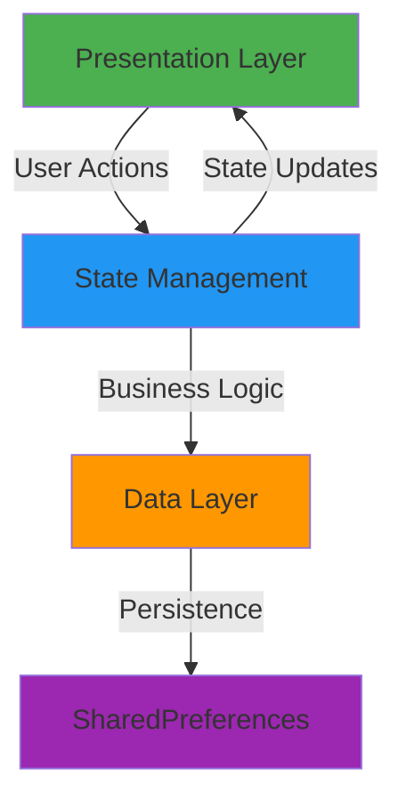
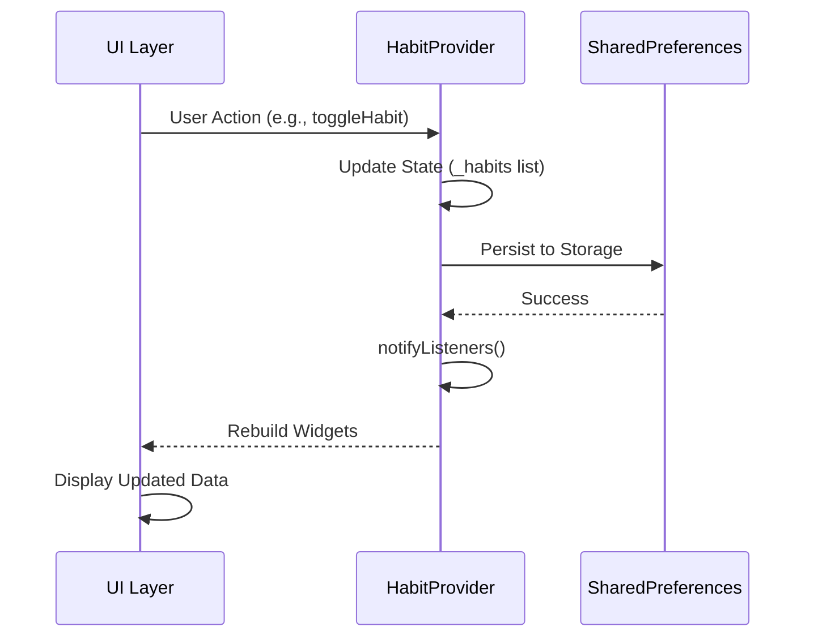

<div align="center">

# 🎯 Habit Tracker

### *Build Better Habits, One Day at a Time*

[](https://flutter.dev)
[](https://dart.dev)
[](https://pub.dev/packages/provider)
[](LICENSE)

**A beautiful, feature-rich habit tracking app built with Flutter**

[Features](#-key-features) • [Screenshots](#-screenshots) • [Getting Started](#-getting-started) • [Architecture](#-architecture) • [Documentation](#-documentation)

</div>

---

## 🌟 Overview

**Habit Tracker** is a comprehensive productivity application that helps you build and maintain positive habits through visual tracking, analytics, and smart reminders. With support for multiple platforms and a beautiful dark-mode interface, staying on track has never been easier.

### ✨ Why Habit Tracker?

- 📊 **Visual Progress Tracking** - See your streak and completion rates at a glance
- 🎨 **Beautiful UI** - Modern Material 3 design with smooth animations
- 📱 **Cross-Platform** - Works on Android, iOS, Web, Linux, macOS, and Windows
- 🔔 **Smart Reminders** - Never miss a habit with customizable notifications
- 📈 **Detailed Analytics** - Understand your habits with interactive charts
- 🏠 **Home Widget** - Quick stats right on your Android home screen
- 💾 **Local Storage** - All your data stays on your device

---

## 🚀 Key Features

<table>
<tr>
<td width="33%" valign="top">

### 🎪 Habit Management
- ✅ Create unlimited habits
- 🏷️ 7 pre-defined categories
- 📅 Calendar-based tracking
- ⚡ One-tap completion toggle
- 🗑️ Easy deletion with confirmation
- 💾 Automatic data persistence

</td>
<td width="33%" valign="top">

### 📝 Task Management
- ✏️ Create detailed tasks
- 🎯 Priority levels (High/Medium/Low)
- 📂 Category organization
- ✔️ Quick completion tracking
- 🎨 Visual priority indicators
- 🔄 Real-time updates

</td>
<td width="33%" valign="top">

### 📊 Analytics & Insights
- 📈 Completion percentages
- 🔥 Streak tracking
- 🎯 Category performance
- 📉 Interactive pie charts
- 📅 Historical data views
- 🏆 Progress visualization

</td>
</tr>
</table>

---

## 📸 Screenshots

<div align="center">

| Home Screen | Analytics | Habit Details | Task Manager |
|:-----------:|:---------:|: -------------:|: ------------:|
|  |  |  |  |

*Replace with actual screenshots*

</div>

---

## 🏗️ Architecture

### Clean Architecture with Provider Pattern



<details>
<summary><b>📂 Project Structure (Click to expand)</b></summary>

```
lib/
├── 📱 main.dart                    # App entry point
├── 🎨 render. dart                  # Widget rendering utilities
│
├── 📦 models/                      # Data Models
│   ├── habit.dart                  # Habit entity
│   └── task.dart                   # Task entity
│
├── 🖥️ screens/                     # UI Screens
│   ├── main_scaffold.dart          # Navigation root
│   ├── home_screen.dart            # Dashboard
│   ├── stats_screen.dart           # Analytics
│   ├── habit_details_screen.dart   # Habit details
│   └── tasks_screen.dart           # Task management
│
├── 🔄 services/                    # State Management
│   └── habit_provider.dart         # Central provider
│
├── 🧩 widgets/                     # Reusable Components
│   └── widget_renderer.dart        # Widget components
│
├── 🛠️ utils/                       # Utilities
│   └── habit_categories.dart       # Category definitions
│
└── 🎨 theme/                       # Theme Configuration
```

</details>

---

## 🛠️ Tech Stack

<div align="center">

| Category | Technologies |
|: --------:|:------------|
| **Framework** | Flutter 3.10.3+, Dart 3.10.3+ |
| **State Management** | Provider 6.1.5, ChangeNotifier |
| **UI/UX** | Material 3, Google Fonts (Inter), Cupertino Icons |
| **Data Storage** | SharedPreferences 2.5.4, JSON Serialization |
| **Charts** | FL Chart 1.1.1 |
| **Calendar** | Table Calendar 3.2.0 |
| **Notifications** | Flutter Local Notifications 17.0.0 |
| **Widgets** | Home Widget 0.7.0 (Android) |
| **Utilities** | Timezone 0.9.2, Intl 0.20.2 |

</div>

---

## 🎨 Categories

<div align="center">

| Category | Icon | Color | Use Case |
|:--------:|:----:|:-----:|:---------|
| **Health** | ♥️ | 🔴 Red | Medical checkups, vitamins, sleep |
| **Work** | 💼 | 🔵 Blue | Projects, meetings, professional goals |
| **Studies** | 📚 | 🟠 Orange | Learning, reading, courses |
| **Fitness** | 💪 | 🟢 Green | Exercise, sports, physical activities |
| **Mental** | 🧘 | 🟣 Purple | Meditation, journaling, mindfulness |
| **Social** | 👥 | 🩷 Pink | Connections, relationships, networking |
| **Other** | ⚙️ | ⚫ Gray | Miscellaneous habits |

</div>

---

## 📦 Data Models

### Habit Model

```dart
class Habit {
  final String id;                  // Unique identifier
  final String title;               // Habit name
  final List<String> completedDays; // Completion dates (YYYY-MM-DD)
  final DateTime dateCreated;       // Creation timestamp
  final String category;            // Category name
  
  bool isCompleted(DateTime date);  // Check completion status
}
```

### Task Model

```dart
class Task {
  final String id;          // Unique identifier
  final String title;       // Task description
  final bool isCompleted;   // Completion status
  final String priority;    // High/Medium/Low
  final String category;    // Category name
  
  Task copyWith({... });     // Immutable update pattern
}
```

---

## 🚀 Getting Started

### Prerequisites

- Flutter SDK 3.10.3+
- Dart SDK 3.10.3+
- Android Studio / Xcode (for mobile development)

### Installation

```bash
# Clone the repository
git clone https://github.com/TheNityant/Flutter-Development-Lab.git
cd Flutter-Development-Lab/habit_tracker

# Install dependencies
flutter pub get

# Run on your preferred platform
flutter run                # Default device
flutter run -d android     # Android
flutter run -d ios         # iOS
flutter run -d web         # Web
flutter run -d macos       # macOS
flutter run -d windows     # Windows
flutter run -d linux       # Linux
```

### Quick Start

1. **Create a Habit**:  Tap the `+` button on the home screen
2. **Select Category**: Choose from 7 pre-defined categories
3. **Track Progress**: Tap the habit card to mark as complete
4. **View Analytics**: Navigate to the Stats tab for insights
5. **Manage Tasks**: Add tasks with priorities and track them

---

## 🔄 State Management Flow



### Key Provider Methods

```dart
// Habit Management
void addHabit(String title, String category)
void toggleHabit(String id, DateTime date)
void deleteHabit(String id)

// Task Management
void addTask(String title, String priority, String category)
void toggleTask(String id)
void deleteTask(String id)

// Data Persistence
void _saveHabitsToStorage()
void _loadHabitsFromStorage()
```

### Usage in Widgets

```dart
// Option 1: Consumer (Recommended)
Consumer<HabitProvider>(
  builder: (context, provider, child) {
    return ListView(
      children: provider.habits.map((habit) => HabitTile(habit)).toList(),
    );
  },
)

// Option 2: Direct Access (with rebuild)
final habits = Provider.of<HabitProvider>(context).habits;

// Option 3: One-time Access (no rebuild)
final provider = Provider.of<HabitProvider>(context, listen: false);
provider.addHabit('New Habit', 'Fitness');
```

---

## 💾 Data Persistence

### Storage Strategy

- **Engine**: SharedPreferences (key-value store)
- **Format**: JSON serialization
- **Keys**: `'habits'` and `'tasks'`
- **Lifecycle**: Auto-save on every change, auto-load on app start

### Storage Example

```json
{
  "habits": [
    {
      "id":  "2025-12-26T14:30:45. 123456",
      "title": "Morning Exercise",
      "completedDays": ["2025-12-26", "2025-12-25", "2025-12-24"],
      "dateCreated": "2025-12-20T08:00:00.000",
      "category": "Fitness"
    }
  ],
  "tasks": [
    {
      "id": "2025-12-26T14:30:45.123456",
      "title": "Complete project report",
      "isCompleted": true,
      "priority":  "High",
      "category":  "Work"
    }
  ]
}
```

---

## 🏠 Android Home Widget

### Features

- 📊 Real-time habit completion percentage
- 🔥 Current streak display
- 📈 Visual progress indicator
- 👆 One-tap app launch

### Implementation

The widget automatically updates when:
- A new habit is added
- Habit completion status changes
- A habit is deleted

```dart
void _updateAndroidWidget() {
  HomeWidget. updateWidget(
    name: 'HabitTrackerWidget',
    androidName: 'HabitTrackerWidget',
  );
}
```

---

## 🔔 Notifications

### Features

- ⏰ Scheduled daily reminders
- 🌍 Timezone-aware scheduling
- 🎯 Per-habit customization
- 📱 Native notification support

### Setup

```dart
// Initialize notifications
final FlutterLocalNotificationsPlugin flutterLocalNotificationsPlugin =
    FlutterLocalNotificationsPlugin();

// Schedule a notification
await flutterLocalNotificationsPlugin.zonedSchedule(
  habitId,
  'Habit Reminder',
  'Time to complete:  ${habit.title}',
  scheduledDate,
  notificationDetails,
);
```

---

## 👨‍💻 Development Guide

### Adding a New Category

1. **Update the category list** in `lib/utils/habit_categories.dart`:

```dart
static const List<String> list = [
  'Health',
  'Work',
  'Studies',
  'Fitness',
  'Mental',
  'Social',
  'NewCategory',  // Add here
  'Other'
];
```

2. **Add icon mapping**:

```dart
static IconData getIcon(String category) {
  switch (category) {
    case 'NewCategory':
      return Icons.new_category_icon;
    // ... other cases
  }
}
```

3. **Add color mapping**:

```dart
static Color getColor(String category) {
  switch (category) {
    case 'NewCategory':
      return Colors.newColor;
    // ... other cases
  }
}
```

### Code Style Guidelines

- ✅ One file = One primary class
- ✅ Models are immutable (use `copyWith`)
- ✅ Always call `notifyListeners()` after state changes
- ✅ Use `Consumer` for reactive widgets
- ✅ Keep business logic in Provider
- ✅ Keep UI in Screens/Widgets
- ✅ Always serialize/deserialize data

### Debugging Tips

```bash
# Verbose logging
flutter run -v

# Check SharedPreferences data
final prefs = await SharedPreferences. getInstance();
print(prefs.getKeys());
print(prefs.getString('habits'));
```

---

## 📚 Documentation

<details>
<summary><b>🎯 Habit Management</b></summary>

### Creating a Habit

```dart
final provider = Provider.of<HabitProvider>(context, listen: false);
provider.addHabit('Morning Run', 'Fitness');
```

### Marking as Complete

```dart
provider.toggleHabit(habitId, DateTime.now());
```

### Deleting a Habit

```dart
provider.deleteHabit(habitId);
```

### Checking Completion

```dart
bool isCompleted = habit.isCompleted(DateTime.now());
```

</details>

<details>
<summary><b>📝 Task Management</b></summary>

### Creating a Task

```dart
provider.addTask('Complete project', 'High', 'Work');
```

### Toggling Completion

```dart
provider.toggleTask(taskId);
```

### Updating Priority

```dart
Task updatedTask = task.copyWith(priority: 'High');
```

</details>

<details>
<summary><b>📊 Analytics</b></summary>

### Calculating Completion Rate

```dart
int totalDays = habits.length;
int completedToday = habits.where((h) => h.isCompleted(DateTime.now())).length;
double completionRate = (completedToday / totalDays) * 100;
```

### Streak Calculation

```dart
int calculateStreak(Habit habit) {
  int streak = 0;
  DateTime date = DateTime.now();
  
  while (habit.isCompleted(date)) {
    streak++;
    date = date.subtract(Duration(days: 1));
  }
  
  return streak;
}
```

</details>

---

## 🤝 Contributing

Contributions are welcome! Please follow these guidelines:

1. **Fork** the repository
2. **Create** a feature branch (`git checkout -b feature/AmazingFeature`)
3. **Commit** your changes (`git commit -m 'Add some AmazingFeature'`)
4. **Push** to the branch (`git push origin feature/AmazingFeature`)
5. **Open** a Pull Request

### Development Setup

```bash
# Install dependencies
flutter pub get

# Run tests
flutter test

# Analyze code
flutter analyze

# Format code
flutter format .
```

---

## 🐛 Known Issues

- [ ] iOS widget support not yet implemented
- [ ] Web local storage has size limitations
- [ ] Desktop notifications need platform-specific setup

---

## 🗺️ Roadmap

- [ ] 🌐 Cloud sync across devices
- [ ] 🎨 Custom theme support
- [ ] 📊 More analytics views (weekly/monthly)
- [ ] 🏆 Achievement system
- [ ] 👥 Social features (share progress)
- [ ] 🌍 Multi-language support
- [ ] 📤 Export data (CSV, PDF)
- [ ] 🔄 Import habits from other apps
- [ ] 🎯 Goal setting with milestones
- [ ] 🤖 AI-powered habit suggestions

---

## 📖 Resources

<div align="center">

| Resource | Link |
|: --------:|:----:|
| **Flutter Documentation** | [docs.flutter.dev](https://docs.flutter.dev/) |
| **Provider Package** | [pub.dev/packages/provider](https://pub.dev/packages/provider) |
| **Material Design 3** | [m3.material.io](https://m3.material.io/) |
| **Dart Language** | [dart.dev/guides](https://dart.dev/guides) |
| **FL Chart** | [pub.dev/packages/fl_chart](https://pub.dev/packages/fl_chart) |

</div>

---

## 📄 License

This project is **private** and not publicly licensed.

---

## 👨‍💻 Author

**TheNityant**

- GitHub: [@TheNityant](https://github.com/TheNityant)
- Project: [Flutter Development Lab](https://github.com/TheNityant/Flutter-Development-Lab)

---

## 🙏 Acknowledgments

- Flutter team for the amazing framework
- Material Design team for design guidelines
- Open source community for packages used

---

<div align="center">

### ⭐ Star this repository if you find it helpful!

**Made with ❤️ using Flutter**

*Last Updated: December 30, 2025*

</div>